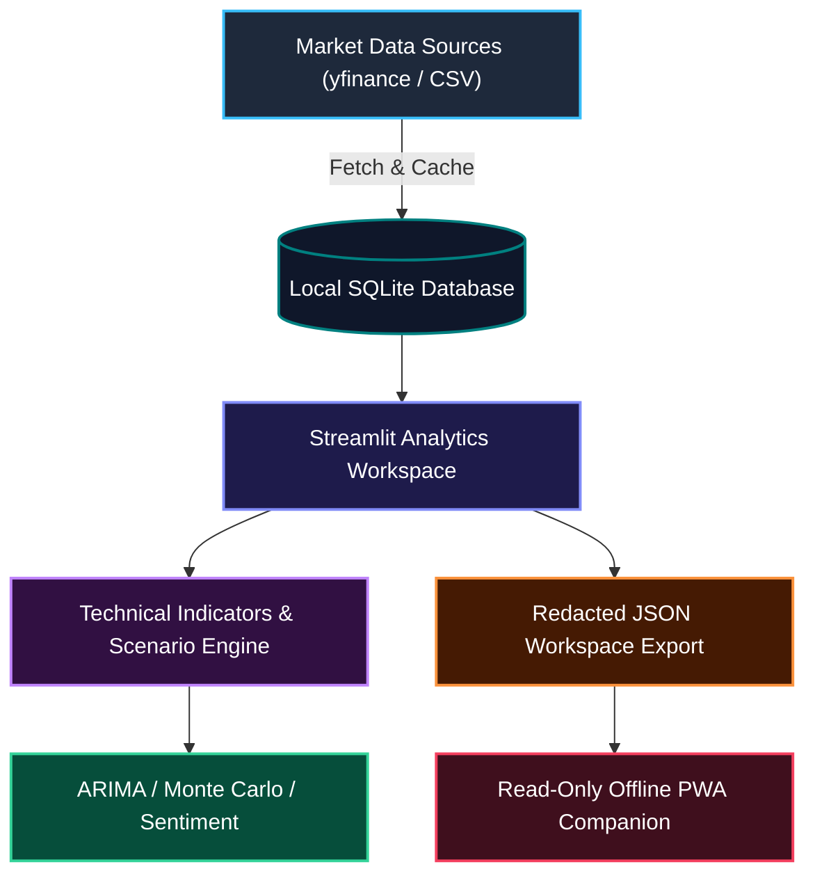

# assistassets-ai

<!-- public-index-last-checked: 2026-08-14 -->

  🌐 <strong>English</strong> | <a href="README_de.md"><strong>Deutsch</strong></a>

  

  
  
  
  
  
  
  

<h3 align="center">Local-first software assistants — starting with finance-oriented evidence review and clear no-advice boundaries</h3>

assistassets-ai builds local-first software assistants: practical tools that help with real, recurring tasks on the user's own machine first, without routing personal or domain-specific data through third-party clouds by default. The public work emphasizes transparent workflows, reproducible local state, inspectable exports, and careful, domain-appropriate boundaries.

The first public assistant is **FinancialProof**, a finance-oriented evidence-review and market-pattern-exploration tool with a strict no-advice boundary (see [Use Boundary](#use-boundary) below). Additional local-first assistants — for everyday tasks such as appointment coordination and personal task assistance — are currently in preparation and will join this public index once they are ready for public release.

> [!NOTE]
> **Machine-Readable Navigation Context**: AI agents and automated tools can inspect [`llms.txt`](https://github.com/assistassets-ai/.github/blob/main/llms.txt) for canonical repositories, public project roles, risk boundaries, and preferred search phrases.

---

## Featured Assistant: FinancialProof

FinancialProof is the organization's first public local-first assistant: a Streamlit-based workspace for historical market-pattern analysis, technical indicators, and evidence-oriented review, with a strict no-advice boundary.

### Architecture & Data Flow

## Start Here

| Need | Start with | Why |
|---|---|---|
| Explore historical market patterns locally | [FinancialProof](https://github.com/assistassets-ai/FinancialProof) | Streamlit-based analysis workspace for market data, yfinance access, technical indicators, ARIMA, Monte Carlo, sentiment, SQLite-backed state, optional ML/NLP modules, and offline/PWA exports |
| Understand the public organization profile | [`.github`](https://github.com/assistassets-ai/.github) | Shared profile README, community files, and `llms.txt` navigation for assistassets-ai |

## Public Repository Directory

This public profile intentionally lists public repositories only. Private or internal repositories are intentionally omitted from the public index.

Verified public index: `FinancialProof` and `.github` were checked against the live GitHub organization on **2026-08-14**. No active public repository is missing from this directory.

Additional local-first assistants are currently in private development and will be added to this directory once they are ready for public release.

| Project | Stack & Coverage | Description |
|---|---|---|
| [FinancialProof](https://github.com/assistassets-ai/FinancialProof) | Python 3.10+, Streamlit, yfinance, SQLite, PWA · 208 tests | First public local-first Streamlit assistant for historical financial market pattern analysis, technical indicators, scenario exploration, yfinance data access, SQLite-backed state, optional ML/NLP modules, offline/PWA exports, and evidence-oriented review workflows |
| [`.github`](https://github.com/assistassets-ai/.github) | Markdown, GitHub Profile, `llms.txt` | Organization landing page, shared community files, profile assets, workflow templates, and machine-readable `llms.txt` context |

## Capability & Feature Matrix

| Capability / Domain | FinancialProof Implementation | Privacy & Storage Guarantee | Export & Integration Surface |
|---|---|---|---|
| **Market Data Ingestion** | `yfinance` API connector & local CSV uploads | 100% Local SQLite caching (`~/.financialproof/`) | Raw OHLCV data tables & Pandas DataFrame caches |
| **Technical Analysis** | SMA, EMA, RSI, MACD, Bollinger Bands, ATR | Local calculation; zero cloud dependencies | Interactive Plotly charts & summary metrics |
| **Scenario Modeling** | ARIMA time-series forecasting & Monte Carlo paths | On-device execution (scipy, statsmodels) | Distribution plots & parameter logs |
| **Sentiment Analysis** | Local NLP text analysis & keyword scoring | Offline tokenization & evaluation | Sentiment score tables & timeline views |
| **Offline Companion** | Progressive Web App (PWA) manifest & static viewer | Zero tracking; operates completely offline | Redacted JSON workspace exports |
| **Safety Guardrails** | Strict no-advice disclaimers & risk boundaries | Prominent UI warnings on all views | Non-prescriptive exploratory reports |

## Public Activity Snapshot

| Project | Default branch | Latest public push | Public role |
|---|---:|---:|---|
| [FinancialProof](https://github.com/assistassets-ai/FinancialProof) | `master` | 2026-07-25 | Active product repository |
| [`.github`](https://github.com/assistassets-ai/.github) | `main` | 2026-08-05 | Active organization profile and public index |

## Discovery Focus

FinancialProof is the organization's current featured assistant and public product surface. The best external search framing is precise and risk-aware: local-first finance analysis, Streamlit stock-analysis dashboards, historical technical indicators, yfinance data access, SQLite-backed watchlists, offline/PWA exports, and no-financial-advice boundaries.

## Use Boundary

This boundary currently documents FinancialProof, the organization's first public assistant. Future assistants will document their own domain-appropriate boundaries as they are released.

> [!IMPORTANT]
> assistassets-ai repositories are software and research tools. They are **not financial advisers**, **not trading systems**, **not tax or legal advisers**, and **not a substitute for professional review**. Outputs should be treated as exploratory historical analysis, workflow support, or documentation aids, not as forecasts, guarantees, or instructions to buy, sell, hold, allocate assets, or make legal, tax, or accounting decisions.

## Design Principles

- **Local first:** user data, generated artifacts, and assistant state stay on the user's machine unless an external data source is explicitly configured.
- **Domain-appropriate boundary clarity:** each assistant documents its own boundary; FinancialProof, for example, avoids investment, tax, legal, or guaranteed-outcome claims in its READMEs and UI text.
- **Inspectable workflows:** calculations, assumptions, exports, and local state are documented for human and LLM-assisted review.
- **Practical tooling:** assistants support repeated real workflows, including data import, comparison, review, export, and handoff.
- **Privacy-conscious defaults:** tools minimize unnecessary uploads, account requirements, and hidden remote processing.

## Machine-Readable Context

For crawlers and LLM tools, see [`llms.txt`](https://github.com/assistassets-ai/.github/blob/main/llms.txt). It lists canonical repositories, public project roles, risk boundaries, and preferred search phrases for the assistassets-ai organization.

## Search Phrases

- assistassets-ai local-first software assistants
- local-first assistant family
- assistassets-ai FinancialProof
- local-first financial analysis
- local-first Streamlit stock analysis
- Streamlit market analysis workspace
- historical market pattern exploration
- historical technical indicators yfinance SQLite watchlist
- FinancialProof workspace export PWA companion
- finance evidence review workflow
- no trading advice software
- no financial advice Streamlit dashboard
- FinancialProof market evidence review
- SQLite-backed finance analysis workspace

## Ecosystem & Network

assistassets-ai is the local-first assistant branch of the broader local-first software and research ecosystem:

| Organization | Focus Area |
|---|---|
| [open-bricks](https://github.com/open-bricks) | Dachorganisation / Umbrella org for local-first desktop software & tools |
| [file-bricks](https://github.com/file-bricks) | PySide6 desktop file management, sync, and indexing utilities |
| [doc-bricks](https://github.com/doc-bricks) | Document processing, markdown tools, and reader utilities |
| [dev-bricks](https://github.com/dev-bricks) | Developer tools, test environments, and CLI utilities |
| [ellmos-ai](https://github.com/ellmos-ai) | AI infrastructure, MCP servers, agent frameworks, and orchestration |
| [research-line](https://github.com/research-line) | Scientific research, mathematical proofs, and open-science repositories |
| [biotec-line](https://github.com/biotec-line) | Bioinformatics, VCF handling, and genetic data tools |
| [entertain-and-more](https://github.com/entertain-and-more) | Terminal games, audio tools, and entertainment software |
| [lukisch](https://github.com/lukisch) | Personal GitHub developer profile |
