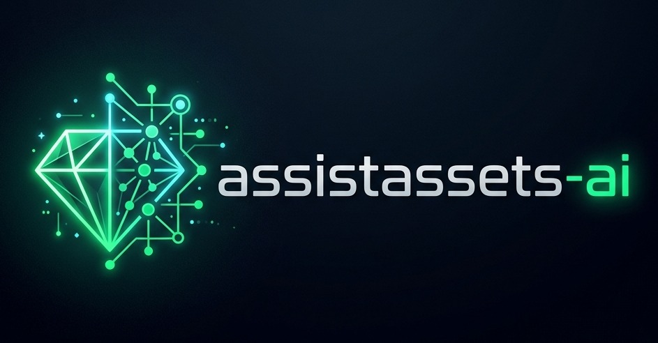

  

# assistassets-ai

<!-- public-index-last-checked: 2026-06-11 -->

**Local-first tools for finance-oriented evidence review and market-pattern exploration with clear no-advice boundaries.**

assistassets-ai builds practical software for checking, structuring, and exploring finance-related data or evidence bundles on the user's own machine first. The public work emphasizes transparent analysis workflows, reproducible local state, and cautious wording around regulated domains.

## Start Here

| Need | Start with | Why |
|---|---|---|
| Explore historical market patterns locally | [FinancialProof](https://github.com/assistassets-ai/FinancialProof) | Streamlit-based analysis workspace for market data, indicators, ARIMA, Monte Carlo, sentiment, and machine-learning experiments |
| Understand the public organization profile | [`.github`](https://github.com/assistassets-ai/.github) | Shared profile README, community files, and `llms.txt` navigation for assistassets-ai |

## Public Projects

This public profile intentionally lists public repositories only. Private or internal work is omitted from the public index.

### Financial Analysis And Evidence Workflows

| Project | Description |
|---|---|
| [FinancialProof](https://github.com/assistassets-ai/FinancialProof) | Local-first Streamlit tool for historical financial market pattern analysis, technical indicators, scenario exploration, SQLite-backed state, and evidence-oriented review workflows |

## Use Boundary

assistassets-ai repositories are software and research tools. They are **not financial advisers**, **not trading systems**, **not tax or legal advisers**, and **not a substitute for professional review**. Outputs should be treated as exploratory analysis, workflow support, or documentation aids, not as instructions to buy, sell, hold, allocate assets, or make legal, tax, or accounting decisions.

## Design Principles

- **Local first:** user data, generated artifacts, and analysis state should stay on the user's machine unless an external data source is explicitly configured.
- **No-advice clarity:** READMEs and UI text should avoid investment, tax, legal, or guaranteed-outcome claims.
- **Inspectable workflows:** calculations, assumptions, exports, and local state should be documented enough for human and LLM-assisted review.
- **Practical tooling:** projects should help repeated real workflows, including data import, comparison, review, export, and handoff.
- **Privacy-conscious defaults:** tools should minimize unnecessary uploads, account requirements, and hidden remote processing.

## Machine-Readable Context

For crawlers and LLM tools, see [`llms.txt`](https://github.com/assistassets-ai/.github/blob/main/llms.txt). It lists canonical repositories, public project roles, risk boundaries, and preferred search phrases for the assistassets-ai organization.

## Ecosystem

assistassets-ai is the finance-and-assistant branch of the broader brick and AI tool ecosystem:

[open-bricks](https://github.com/open-bricks) | [file-bricks](https://github.com/file-bricks) | [doc-bricks](https://github.com/doc-bricks) | [dev-bricks](https://github.com/dev-bricks) | [ellmos-ai](https://github.com/ellmos-ai)
