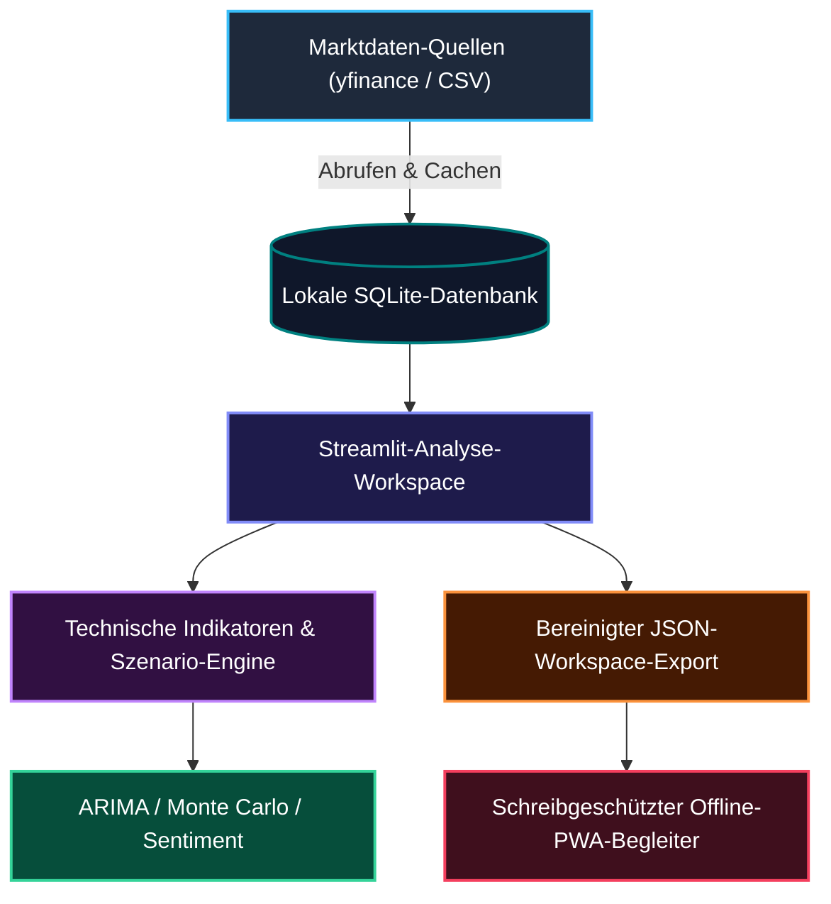

# assistassets-ai

<!-- public-index-last-checked: 2026-08-25 -->

  🌐 <a href="README.md"><strong>English</strong></a> | <strong>Deutsch</strong>

  

  
  
  
  
  
  
  

<h3 align="center">Local-first Software-Assistenten — beginnend mit finanzorientierter Evidenzprüfung und klaren Grenzen gegen Finanzberatung</h3>

assistassets-ai entwickelt local-first Software-Assistenten: praxisnahe Werkzeuge, die bei wiederkehrenden, realen Aufgaben helfen – primär auf dem eigenen System des Nutzers, ohne persönliche oder fachbezogene Daten standardmäßig über Drittanbieter-Clouds zu leiten. Die öffentlichen Arbeiten betonen transparente Workflows, reproduzierbaren lokalen Zustand, überprüfbare Exporte und eine sorgfältige, fachbereichsgerechte Abgrenzung.

Der erste öffentliche Assistent ist **FinancialProof**, ein finanzorientiertes Werkzeug zur Evidenzprüfung und Markt-Muster-Analyse mit einer strikten Grenze gegen Finanzberatung (siehe [Nutzungsgrenze](#nutzungsgrenze) weiter unten). Weitere local-first Assistenten – etwa für Alltagsaufgaben wie Terminkoordination und persönliche Aufgabenunterstützung – befinden sich derzeit in Vorbereitung und werden diesem öffentlichen Index hinzugefügt, sobald sie für die Veröffentlichung bereit sind.

> [!NOTE]
> **Maschinenlesbarer Kontext**: KI-Agenten und automatisierte Werkzeuge finden in [`llms.txt`](https://github.com/assistassets-ai/.github/blob/main/llms.txt) kanonische Repositories, öffentliche Projektrollen, Nutzungsgrenzen und bevorzugte Suchphrasen.

---

## Featured Assistant: FinancialProof

FinancialProof ist der erste öffentliche local-first Assistent der Organisation: ein Streamlit-basierter Workspace für die historische Analyse von Marktmustern, technische Indikatoren und evidenzorientierte Prüfung – mit einer strikten Grenze gegen Finanzberatung.

### Architektur & Datenfluss

## Einstieg

| Bedarf | Starten mit | Grund |
|---|---|---|
| Historische Marktmuster lokal untersuchen | [FinancialProof](https://github.com/assistassets-ai/FinancialProof) | Streamlit-basierter Analyse-Workspace für Marktdaten, yfinance-Zugriff, technische Indikatoren, ARIMA, Monte Carlo, Sentiment, SQLite-gestützten Zustand, optionale ML/NLP-Module und Offline/PWA-Exporte |
| Das öffentliche Organisationsprofil verstehen | [`.github`](https://github.com/assistassets-ai/.github) | Gemeinsames Profil-README, Community-Dateien und `llms.txt`-Navigation für assistassets-ai |

## Öffentliches Repository-Verzeichnis

Dieses öffentliche Profil führt bewusst ausschließlich öffentliche Repositories auf. Private oder interne Repositories sind im öffentlichen Index bewusst nicht enthalten.

Verifizierter öffentlicher Index: `FinancialProof` und `.github` wurden am **25.08.2026** mit der Live-Organisation auf GitHub abgeglichen. Es fehlt kein aktives öffentliches Repository.

Weitere local-first Assistenten befinden sich derzeit in privater Entwicklung und werden diesem Verzeichnis hinzugefügt, sobald sie für die Veröffentlichung bereit sind.

| Projekt | Stack & Abdeckung | Beschreibung |
|---|---|---|
| [FinancialProof](https://github.com/assistassets-ai/FinancialProof) | Python 3.10+, Streamlit, yfinance, SQLite, PWA · 208 Tests | Erster öffentlicher local-first Streamlit-Assistent zur historischen Analyse von Finanzmarktmustern, technischen Indikatoren, Szenario-Untersuchungen, yfinance-Datenzugriff, SQLite-gestütztem Zustand, optionalen ML/NLP-Modulen, Offline/PWA-Exporten und evidenzorientierten Review-Workflows |
| [`.github`](https://github.com/assistassets-ai/.github) | Markdown, GitHub-Profil, `llms.txt` | Organisations-Startseite, gemeinsame Community-Dateien, Profil-Assets, Workflow-Templates und maschinenlesbarer `llms.txt`-Kontext |

## Leistungs- und Feature-Matrix

| Funktion / Bereich | FinancialProof Implementierung | Datenschutz & Lokale Speicherung | Export & Schnittstellen |
|---|---|---|---|
| **Marktdaten-Erfassung** | `yfinance` API-Konnektor & lokale CSV-Importe | 100% lokales SQLite-Caching (`~/.financialproof/`) | OHLCV-Rohdatentabellen & Pandas DataFrame Caches |
| **Technische Analyse** | SMA, EMA, RSI, MACD, Bollinger Bands, ATR | Vollständig lokale Berechnung; 0 Cloud-Zwang | Interaktive Plotly Charts & Kennzahlen-Übersichten |
| **Szenario-Modellierung** | ARIMA Zeitreihen-Prognosen & Monte-Carlo-Pfade | Berechnung auf dem Endgerät (scipy, statsmodels) | Verteilungsdiagramme & Parameter-Protokolle |
| **Sentiment-Analyse** | Lokale NLP-Textanalyse & Schlagwort-Scoring | Offline Tokenisierung & Bewertung | Sentiment-Score-Tabellen & Zeitverläufe |
| **Offline-Begleiter** | Progressive Web App (PWA) Manifest & statischer Viewer | Zero-Tracking; vollständig offline nutzbar | Bereinigte JSON-Workspace-Exporte |
| **Sicherheits-Leitplanken** | Strikte Keine-Finanzberatung-Hinweise & Risikogrenzen | Deutliche UI-Hinweise in allen Ansichten | Nicht-präskriptive explorative Berichte |

## Aktueller Aktivitäts-Snapshot

| Projekt | Default-Branch | Letzter öffentlicher Push | Öffentliche Rolle |
|---|---:|---:|---|
| [FinancialProof](https://github.com/assistassets-ai/FinancialProof) | `master` | 25.07.2026 | Aktives Produkt-Repository |
| [`.github`](https://github.com/assistassets-ai/.github) | `main` | 25.08.2026 | Aktives Organisations-Profil und öffentlicher Index |

## Auffindbarkeit & Fokus

FinancialProof ist der aktuelle Featured Assistant und die öffentliche Produktfläche der Organisation. Die beste externe Such-Formulierung ist präzise und risikobewusst: Local-first Finanzanalyse, Streamlit Aktienanalyse-Dashboards, historische technische Indikatoren, yfinance-Datenzugriff, SQLite-gestützte Watchlists, Offline/PWA-Exporte und klare Abgrenzungen gegen Finanzberatung.

## Nutzungsgrenze

Diese Nutzungsgrenze beschreibt aktuell FinancialProof, den ersten öffentlichen Assistenten der Organisation. Künftige Assistenten dokumentieren ihre eigene, fachbereichsgerechte Nutzungsgrenze, sobald sie veröffentlicht werden.

> [!IMPORTANT]
> assistassets-ai Repositories sind Software- und Forschungswerkzeuge. Sie sind **keine Finanzberater**, **keine Handelssysteme**, **keine Steuer- oder Rechtsberater** und **kein Ersatz für professionelle Prüfungen**. Ergebnisse sind als explorative historische Analysen, Workflow-Unterstützungen oder Dokumentationshilfen zu verstehen – nicht als Prognosen, Garantien oder Handlungsanweisungen zum Kaufen, Verkaufen, Halten, Umschichten oder zu rechtlichen, steuerlichen oder buchhalterischen Entscheidungen.

## Design-Prinzipien

- **Local first:** Nutzerdaten, generierte Artefakte und Assistenten-Zustände verbleiben auf dem Gerät des Nutzers, sofern nicht explizit eine externe Datenquelle konfiguriert ist.
- **Fachbereichsgerechte Abgrenzung:** Jeder Assistent dokumentiert seine eigene Nutzungsgrenze; FinancialProof vermeidet beispielsweise Investitions-, Steuer-, Rechts- oder Gewinngarantie-Aussagen in READMEs und UI-Texten.
- **Überprüfbare Workflows:** Berechnungen, Annahmen, Exporte und lokaler Zustand sind für menschliche und KI-unterstützte Reviews dokumentiert.
- **Praktische Werkzeuge:** Assistenten unterstützen wiederkehrende reale Abläufe wie Datenimport, Vergleich, Prüfung, Export und Übergabe.
- **Datenschutzbewusste Standards:** Werkzeuge minimieren unnötige Uploads, Kontozwänge und verborgene Remote-Verarbeitung.

## Maschinenlesbarer Kontext

Für Crawler und KI-Werkzeuge siehe [`llms.txt`](https://github.com/assistassets-ai/.github/blob/main/llms.txt). Dort sind kanonische Repositories, öffentliche Projektrollen, Nutzungsgrenzen und bevorzugte Suchbegriffe der Organisation assistassets-ai zusammengestellt.

## Suchbegriffe (Search Phrases)

- assistassets-ai local-first Software-Assistenten
- local-first Assistenten-Familie
- assistassets-ai FinancialProof
- local-first Finanzanalyse
- local-first Streamlit Aktienanalyse
- Streamlit Marktanalyse Workspace
- historische Marktmuster Erkundung
- technische Indikatoren yfinance SQLite Watchlist
- FinancialProof Workspace Export PWA Begleiter
- Finanz Evidenz Review Workflow
- keine Handelsberatung Software
- keine Finanzberatung Streamlit Dashboard
- FinancialProof Markt Evidenz Prüfung
- SQLite-gestützter Finanzanalyse Workspace
- Offline-first Finanz-Evidenz-Prüfung
- risikobewusster Marktanalyse-Workspace
- local-first Finanzassistent ohne Beratungsanspruch

## Ökosystem & Netzwerk

assistassets-ai bildet den Local-First-Assistenten-Zweig des breiteren Local-First Software- und Forschungsökosystems:

| Organisation | Fokusbereich |
|---|---|
| [open-bricks](https://github.com/open-bricks) | Dachorganisation / Umbrella org für Local-First Desktop-Software & Tools |
| [file-bricks](https://github.com/file-bricks) | PySide6 Desktop Datei-Management, Sync- und Indizierungs-Utilities |
| [doc-bricks](https://github.com/doc-bricks) | Dokumentenverarbeitung, Markdown-Tools und Reader-Utilities |
| [dev-bricks](https://github.com/dev-bricks) | Entwickler-Werkzeuge, Test-Umgebungen und CLI-Utilities |
| [ellmos-ai](https://github.com/ellmos-ai) | KI-Infrastruktur, MCP-Server, Agenten-Frameworks und Orchestrierung |
| [research-line](https://github.com/research-line) | Wissenschaftliche Forschung, mathematische Beweise und Open-Science Repositories |
| [biotec-line](https://github.com/biotec-line) | Bioinformatik, VCF-Handling und genetische Daten-Werkzeuge |
| [entertain-and-more](https://github.com/entertain-and-more) | Terminal-Spiele, Audio-Tools und Entertainment-Software |
| [lukisch](https://github.com/lukisch) | Persönliches GitHub-Entwicklerprofil |
